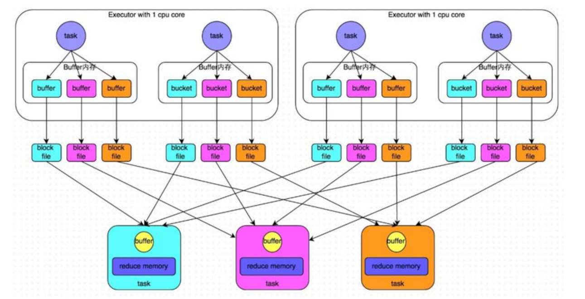
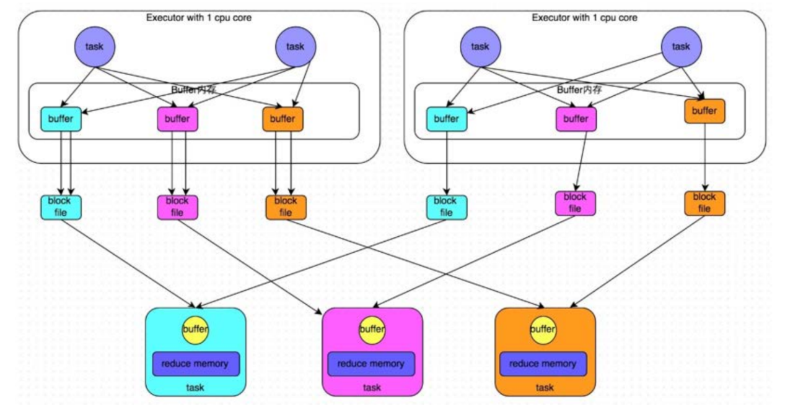
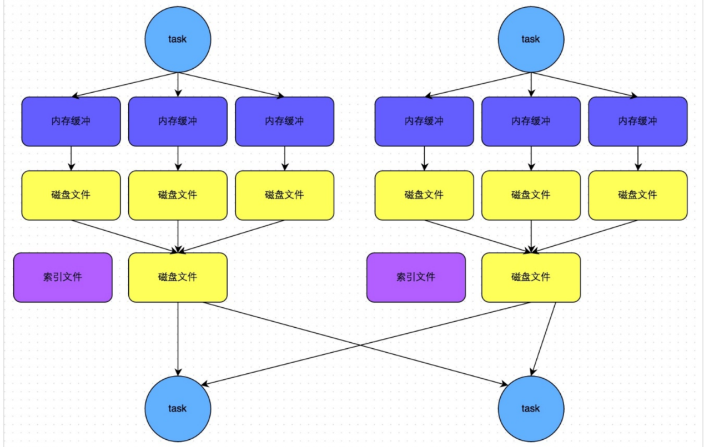

# Spark Shuffle解析以及内存管理

## Spark Shuffle解析
### ShuffleMapStage和ResultStage

- 在划分Stage时，最后一个Stage称为`finalStage`，本质上一个`ResultStage`对象，在ResultStage之前的Stage称为`ShuffleMapStage`。
- `shuffleMapStage`的结束伴随着**Shuffle文件的写磁盘** 。
- `resultMapStage`基本上对应代码中的`ation`算子，即，将一个函数应用在RDD的各个Partition的数据集上，**意味着一个job的运行结束**。
### Shuffle中任务个数
 Spark Shuffle分为`map`（ShuffleRead）阶段和`reduce`（ShuffleWrite）阶段，每个阶段都会由若干个`task`来执行，如何确定`mapTask`和`reduceTask`的数量呢？
 假设Spark任务从HDFS中读取数据，那么，**初始RDD分区个数**由该文件的`split`个数决定，一个`split`对应生成一个`partition`，假设初始`partition`个数为**N**。
 初始RDD经过一些列计算后（没有执行`repartition`和`coalesce`进行重分区），分区数不变，当执行shuffle操作时，**map端的task个数和partition个数一致**，即，`mapTask`个数为**N**。
 reducce端的stage默认取spark.default.parallelism配置的分区数（默认为**父RDD**中最大分区数），即，`reduceTask`个数为**N**。
 ### reduce端数据的读取
 `mapTask`位于`ShuffleMapStage`，`reduceTask`位于`ResultStage`，mapTask 会先执行，那么后执行的 reduceTask 如何知道从哪里去拉取 mapTask 落盘后的数据呢？
 reduce端拉取数据过程如下：
1. `mapTask`执行完毕后会将计算状态以及磁盘小文件位置等信息封装到`mapStatus`对象中，然后由本进程中的`mapOutPutTrackerWorker`对象将`mapstatus`对象发送给`Driver
`进程的`mapOutPutTrackerMaster`对象；
2. 在`reduceTask`开始执行之前会额按本进程中的`mapOutPutTrackerWorker`向`Driver`进程中的`mapOutPutTrackerMaster`发送请求，请求磁盘小文件位置；
3. 当所有的`mapTask`执行完毕后，`Driver`进程中`mapOutPutTrackerMaster`会告诉`mapOutPutTrackerWorker`磁盘小文件的位置信息；
4. 完成之前的操作之后，由BlockTransformService去Executor0所在节点拉取数据，默认启动5歌子线程。每次拉去的数据量不超过48MB（reduceTask每次最多拉取48MB
数据，将拉来的数据存储到Executor内的20%内存（通过[`参数`](../../../../../../README.md#优化资源)来设置）中）
### HashShuffle和SortShuffle
#### HashShuffle
1. 未经优化的HashShuffleManager
- `shuffleWrite`阶段，作用：在一个`stage结束计算之后`，下一个stage可以执行`shuffle类算子`（如：reduceByKey），而将每个task处理的数据`按key
`进行“划分”;所谓的`划分`就是对`相同的Key`执行`Hash算法`，从而将`相同Key`写入同一个磁盘文件中，而每一个磁盘文件都属于`下游Stage`的一个`task`。再将数据写入磁盘之前，会**先将数据写入内存缓冲中，当内存缓冲填满之后，才会溢写到磁盘文件中**。
**下一个stage的task有多少个，当前stage的每个task就要创建多少分磁盘文件**。比如：下一个stage共100个task，那么当前的stage的每个task都要创建100分磁盘文件，即，一共要从创建（100\*100
=）10000个磁盘文件。~~如果当前stage有50个task，总共10个Executor，每个Executor执行5个Task，那么每个Executor上总共要创建（50\*10=）500个磁盘文件~~未经优化的HashShuffle磁盘文件的数量时惊人的。
- `shuffleRead阶段`，**该`stage`的每一个`task`就需要将上一个`stage`的计算结果中的所有`key`，从各个节点上通过网络拉取到自己所在的节点，然后进行`key
`的聚合或连接操作**。由于`shuffleWrite`的过程中，`mapTask`给下游`stage`的每一`reduceTask`都创建了一个磁盘文件，因为`shuffleRead`的过程中，每个`reduceTask
`只要从上游`stage`的所有`mapTask`所在的节点上，拉取属于自己的那一份磁盘文件即可。
- `shuffleRead`的拉取过程是**一边拉取一边进行聚合**。每个 `shuffleRead` `task` 都会有一个自己的 `buffer 缓冲`，每次都只能拉取与 `buffer
 缓冲`相同大小的数据，然后通过内存中的一个 `Map`进行聚合等操作。聚合完一批数据后，再拉取下一批数据，并放到 buffer 缓冲中进行聚合操作。以此类推，直到最后将所有数据到拉取完，并得到最终的结果。

2. 优化后的HadShuffleManager
- 为了优化`HashShuffleManager`我们可以设置一个参数，`spark.shuffle.consolidateFiles`，该参数**默认值为`false`**，将其设置为true
即可开启优化机制，**通常来说，如果我们使用HashShuffleManager，那么都建议开启这个选项。**
开启`consolidate`机制之后，在`shuffleWrite`过程中，task就不是为下游stage的每个task创建一个磁盘文件了，此时会出现**`shuffleFileGroup`**的概念，**每个shuffleFileGroup
会对应一批磁盘文件，磁盘文件的数量与下游stage的task数量是相同的**。一个Executor上有多少个CPUCore，就可以并行执行多少个task。而**第一批并行执行的每个task都会创建一个`shuffleFileGroup
`，并将数据写入对应的磁盘文件内**。
- 当`Executor`的CPUCore执行完一批task，接着执行下一批task时，**下一批task就会复用之前已有的`shuffleFileGroup`，包括其中的磁盘文件**，也就是说，此时task
会将数据写入已有的磁盘文件中，而不会写入新的磁盘文件中。因此，**consolidate机制允许不同的task复用同一批磁盘文件**，这样就**可以有效将多个task
的磁盘文件进行一定程度上的合并**，从而大幅度减少磁盘文件的数量，进而提升shuffleWrite的性能。
- 假设第二个stage有100个task，第一个stage有50个task，总共还是有10个Executor（ExecutorCPU个数为1），每个Executor执行5个task
。那么原本使用`未经优化的HashShuffleManager`时，每个Executor会产生500个磁盘文件，所有Executor会产生5000个磁盘文件的。但是此时经过优化之后，每个Executor
创建的磁盘文件的数量的计算公式为：**`CPUCore的数量*下一个stage的task数量`**，也就是说，每个Executor此时只会创建100个磁盘文件，所有Executor只会创建1000个磁盘文件。

#### SortShuffle
> `SortShuffleManager`的运行机制主要分成两种，`一种是普通运行机制`，`另一种是bypass运行机制`。当`shuffleReadTask`的数量**小于等于**`spark.shuffle.sort.bypassMergeThreshold`参数的值时（默认为200），就会启用bypass机制。
- 普通运行机制
    - 在该模式下，**数据会先写入一个内存数据结构中**，此时根据不同的shuffle算子，可能选用不同的数据结构。如果是reduceByKey这种聚合类的shuffle算子，那么会选用Map数据结构，一边通过Map
进行聚合，一边写入内存；如果是join这种普通的shuffle算子，那么会选用Array数据结构，直接写入内存。接着，**每写一条数据进入内存数据结构之后，就会判断一下，是否达到了某个临界阈值。如果`达到临界阈值`的话，那么就会`尝试将内存数据结构中的数据溢写到磁盘`，然后`清空内存数据结构`**。
    - **在溢写到磁盘文件之前，会先根据key对内存数据结构中已有的数据进行排序。排序过后，会分批将数据写入磁盘文件**。默认的batch数量是10000条，也就是说，排序好的数据，会以每批1
万条数据的形式分批写入磁盘文件。写入磁盘文件是通过Java的BufferedOutputStream实现的。BufferedOutputStream是Java的缓冲输出流，首先会将数据缓冲在内存中，当内存缓冲满溢之后再一次写入磁盘文件中，这样可以减少磁盘IO次数，提升性能。
    - 一个task将所有数据写入内存数据结构的过程中，会发生多次磁盘溢写操作，也就会产生多个临时文件。最后会将之前所有的临时磁盘文件都进行合并，这就是merge过程，此时会将之前所有临时磁盘文件中的数据读取出来，然后依次写入最终的磁盘文件之中。此外，由于一个task就只对应一个磁盘文件，也就意味着该task为下游stage的task准备的数据都在这一个文件中，因此还会单独写一份索引文件，其中标识了下游各个task的数据在文件中的startOffset与endOffset。
    - SortShuffleManager由于有一个磁盘文件merge的过程，因此大大减少了文件数量。比如第一个stage有50个task，总共有10个Executor，每个Executor执行5个task，而第二个stage有100个task。由于每个task最终只有一个磁盘文件，因此此时每个Executor上只有5个磁盘文件，所有Executor只有50个磁盘文件。
    
- bypass 运行机制
 > bypass运行机制的触发条件如下：
   `shuffleMapTask`数量小于`spark.shuffle.sort.bypassMergeThreshold`参数的值。
   不是聚合类的shuffle算子。
- 每个task会为每个下游task都创建一个临时磁盘文件，并将数据按key进行hash然后根据key的hash值，将key
写入对应的磁盘文件之中。当然，写入磁盘文件时也先写入内存缓冲，缓冲写满之后再溢写到磁盘文件的。最后，同样会将所有临时磁盘文件都合并成一个磁盘文件，并创建一个单独的索引文件。
- 该过程的磁盘写机制其实跟未经优化的HashShuffleManager
是一模一样的，因为都要创建数量惊人的磁盘文件，只是在最后会做一个磁盘文件的合并而已。因此少量的最终磁盘文件，也让该机制相对未经优化的HashShuffleManager来说，shuffleRead的性能会更好。
- 而该机制与普通SortShuffleManager运行机制的不同在于：第一，磁盘写机制不同；第二，不会进行排序。也就是说，启用该机制的最大好处在于，shuffleWrite过程中，不需要进行数据的排序操作，也就节省掉了这部分的性能开销。

## Spark 内存管理