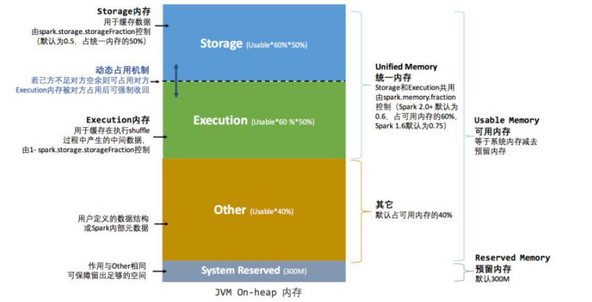

<!-- TOC -->

- [1. Spark Shuffle解析以及内存管理](#1-spark-shuffle解析以及内存管理)
    - [1.1. Spark Shuffle解析](#11-spark-shuffle解析)
        - [1.1.1. ShuffleMapStage和ResultStage](#111-shufflemapstage和resultstage)
        - [1.1.2. Shuffle中任务个数](#112-shuffle中任务个数)
        - [1.1.3. HashShuffle和SortShuffle](#113-hashshuffle和sortshuffle)
            - [1.1.3.1. HashShuffle](#1131-hashshuffle)
            - [1.1.3.2. SortShuffle](#1132-sortshuffle)
    - [1.2. Spark 内存管理](#12-spark-内存管理)
        - [1.2.1. 堆内和堆外内存规划](#121-堆内和堆外内存规划)
        - [1.2.2. 内存分配](#122-内存分配)
            - [1.2.2.1. 静态内存管理](#1221-静态内存管理)
            - [1.2.2.2. 统一内存管理](#1222-统一内存管理)
            - [1.2.2.3. 存储内存管理](#1223-存储内存管理)
                - [1.2.2.3.1. RDD的持久化机制](#12231-rdd的持久化机制)
                - [1.2.2.3.2. RDD的缓存过程](#12232-rdd的缓存过程)
                - [1.2.2.3.3. 淘汰与落盘](#12233-淘汰与落盘)
        - [1.2.3. 执行内存管理](#123-执行内存管理)
            - [1.2.3.1. Shuffle Write](#1231-shuffle-write)
    - [1.3. BlockManager数据存储与管理机制](#13-blockmanager数据存储与管理机制)
    - [1.4. Spark共享变量底层实现](#14-spark共享变量底层实现)
        - [1.4.1. 广播变量](#141-广播变量)
        - [1.4.2. 累加器](#142-累加器)

<!-- /TOC -->

# 1. Spark Shuffle解析以及内存管理
## 1.1. Spark Shuffle解析
### 1.1.1. ShuffleMapStage和ResultStage

- 在划分Stage时，最后一个Stage称为`finalStage`，本质上一个`ResultStage`对象，在ResultStage之前的Stage称为`ShuffleMapStage`。
- `shuffleMapStage`的结束伴随着**Shuffle文件的写磁盘** 。
- `resultMapStage`基本上对应代码中的`ation`算子，即，将一个函数应用在RDD的各个Partition的数据集上，**意味着一个job的运行结束**。
### 1.1.2. Shuffle中任务个数
 Spark Shuffle分为`map`（ShuffleRead）阶段和`reduce`（ShuffleWrite）阶段，每个阶段都会由若干个`task`来执行，如何确定`mapTask`和`reduceTask`的数量呢？
 假设Spark任务从HDFS中读取数据，那么，**初始RDD分区个数**由该文件的`split`个数决定，一个`split`对应生成一个`partition`，假设初始`partition`个数为**N**。
 初始RDD经过一些列计算后（没有执行`repartition`和`coalesce`进行重分区），分区数不变，当执行shuffle操作时，**map端的task个数和partition个数一致**，即，`mapTask`个数为**N**。
 reducce端的stage默认取spark.default.parallelism配置的分区数（默认为**父RDD**中最大分区数），即，`reduceTask`个数为**N**。
 ### reduce端数据的读取
 `mapTask`位于`ShuffleMapStage`，`reduceTask`位于`ResultStage`，mapTask 会先执行，那么后执行的 reduceTask 如何知道从哪里去拉取 mapTask 落盘后的数据呢？
 reduce端拉取数据过程如下：
1. `mapTask`执行完毕后会将计算状态以及磁盘小文件位置等信息封装到`mapStatus`对象中，然后由本进程中的`mapOutPutTrackerWorker`对象将`mapstatus`对象发送给`Driver
`进程的`mapOutPutTrackerMaster`对象；
2. 在`reduceTask`开始执行之前会额按本进程中的`mapOutPutTrackerWorker`向`Driver`进程中的`mapOutPutTrackerMaster`发送请求，请求磁盘小文件位置；
3. 当所有的`mapTask`执行完毕后，`Driver`进程中`mapOutPutTrackerMaster`会告诉`mapOutPutTrackerWorker`磁盘小文件的位置信息；
4. 完成之前的操作之后，由BlockTransformService去Executor0所在节点拉取数据，默认启动5歌子线程。每次拉去的数据量不超过48MB（reduceTask每次最多拉取48MB
数据，将拉来的数据存储到Executor内的20%内存（通过[`参数`](../../../../../../README.md#优化资源)来设置）中）
### 1.1.3. HashShuffle和SortShuffle
#### 1.1.3.1. HashShuffle
1. 未经优化的HashShuffleManager
- `shuffleWrite`阶段，作用：在一个`stage结束计算之后`，下一个stage可以执行`shuffle类算子`（如：reduceByKey），而将每个task处理的数据`按key
`进行“划分”;所谓的`划分`就是对`相同的Key`执行`Hash算法`，从而将`相同Key`写入同一个磁盘文件中，而每一个磁盘文件都属于`下游Stage`的一个`task`。再将数据写入磁盘之前，会**先将数据写入内存缓冲中，当内存缓冲填满之后，才会溢写到磁盘文件中**。
**下一个stage的task有多少个，当前stage的每个task就要创建多少分磁盘文件**。比如：下一个stage共100个task，那么当前的stage的每个task都要创建100分磁盘文件，即，一共要从创建（100\*100
=）10000个磁盘文件。~~如果当前stage有50个task，总共10个Executor，每个Executor执行5个Task，那么每个Executor上总共要创建（50\*10=）500个磁盘文件~~未经优化的HashShuffle磁盘文件的数量时惊人的。
- `shuffleRead阶段`，**该`stage`的每一个`task`就需要将上一个`stage`的计算结果中的所有`key`，从各个节点上通过网络拉取到自己所在的节点，然后进行`key
`的聚合或连接操作**。由于`shuffleWrite`的过程中，`mapTask`给下游`stage`的每一`reduceTask`都创建了一个磁盘文件，因为`shuffleRead`的过程中，每个`reduceTask
`只要从上游`stage`的所有`mapTask`所在的节点上，拉取属于自己的那一份磁盘文件即可。
- `shuffleRead`的拉取过程是**一边拉取一边进行聚合**。每个 `shuffleRead` `task` 都会有一个自己的 `buffer 缓冲`，每次都只能拉取与 `buffer
 缓冲`相同大小的数据，然后通过内存中的一个 `Map`进行聚合等操作。聚合完一批数据后，再拉取下一批数据，并放到 buffer 缓冲中进行聚合操作。以此类推，直到最后将所有数据到拉取完，并得到最终的结果。
 
	
2. 优化后的HadShuffleManager
- 为了优化`HashShuffleManager`我们可以设置一个参数，`spark.shuffle.consolidateFiles`，该**参数默认值为`false`** ，将其设置为true
即可开启优化机制，**通常来说，如果我们使用HashShuffleManager，那么都建议开启这个选项。** 开启`consolidate`机制之后，在`shuffleWrite`过程中，task就不是为下游stage的每个task创建一个磁盘文件了，此时会出现 **`shuffleFileGroup`** 的概念，**每个shuffleFileGroup会对应一批磁盘文件，磁盘文件的数量与下游stage的task数量是相同的**。一个Executor上有多少个CPUCore，就可以并行执行多少个task。而**第一批并行执行的每个task都会创建一个`shuffleFileGroup`，并将数据写入对应的磁盘文件内**。
- 当`Executor`的CPUCore执行完一批task，接着执行下一批task时，**下一批task就会复用之前已有的`shuffleFileGroup`，包括其中的磁盘文件**，也就是说，此时task
会将数据写入已有的磁盘文件中，而不会写入新的磁盘文件中。因此，**consolidate机制允许不同的task复用同一批磁盘文件**，这样就**可以有效将多个task的磁盘文件进行一定程度上的合并**，从而大幅度减少磁盘文件的数量，进而提升shuffleWrite的性能。
- 假设第二个stage有100个task，第一个stage有50个task，总共还是有10个Executor（ExecutorCPU个数为1），每个Executor执行5个task
。那么原本使用`未经优化的HashShuffleManager`时，每个Executor会产生500个磁盘文件，所有Executor会产生5000个磁盘文件的。但是此时经过优化之后，每个Executor
创建的磁盘文件的数量的计算公式为：**`CPUCore的数量*下一个stage的task数量`**，也就是说，每个Executor此时只会创建100个磁盘文件，所有Executor只会创建1000个磁盘文件。

	
#### 1.1.3.2. SortShuffle
> `SortShuffleManager`的运行机制主要分成两种，`一种是普通运行机制`，`另一种是bypass运行机制`。当`shuffleReadTask`的数量**小于等于**`spark.shuffle.sort.bypassMergeThreshold`参数的值时（默认为200），就会启用bypass机制。
- 普通运行机制
	- 在该模式下，**数据会先写入一个内存数据结构中**，此时根据不同的shuffle算子，可能选用不同的数据结构。如果是reduceByKey这种聚合类的shuffle算子，那么会选用Map数据结构，一边通过Map
进行聚合，一边写入内存；如果是join这种普通的shuffle算子，那么会选用Array数据结构，直接写入内存。接着，**每写一条数据进入内存数据结构之后，就会判断一下，是否达到了某个临界阈值。如果`达到临界阈值`的话，那么就会`尝试将内存数据结构中的数据溢写到磁盘`，然后`清空内存数据结构`**。
	- **在溢写到磁盘文件之前，会先根据key对内存数据结构中已有的数据进行排序。排序过后，会分批将数据写入磁盘文件**。默认的batch数量是10000条，也就是说，排序好的数据，会以每批1
万条数据的形式分批写入磁盘文件。写入磁盘文件是通过Java的BufferedOutputStream实现的。BufferedOutputStream是Java的缓冲输出流，首先会将数据缓冲在内存中，当内存缓冲满溢之后再一次写入磁盘文件中，这样可以减少磁盘IO次数，提升性能。
	- 一个task将所有数据写入内存数据结构的过程中，会发生多次磁盘溢写操作，也就会产生多个临时文件。最后会将之前所有的临时磁盘文件都进行合并，这就是merge过程，此时会将之前所有临时磁盘文件中的数据读取出来，然后依次写入最终的磁盘文件之中。此外，由于一个task就只对应一个磁盘文件，也就意味着该task为下游stage的task准备的数据都在这一个文件中，因此还会单独写一份索引文件，其中标识了下游各个task的数据在文件中的startOffset与endOffset。
	- SortShuffleManager由于有一个磁盘文件merge的过程，因此大大减少了文件数量。比如第一个stage有50个task，总共有10个Executor，每个Executor执行5个task，而第二个stage有100个task。由于每个task最终只有一个磁盘文件，因此此时每个Executor上只有5个磁盘文件，所有Executor只有50个磁盘文件。
	
- bypass 运行机制
 > bypass运行机制的触发条件如下：
   `shuffleMapTask`数量小于`spark.shuffle.sort.bypassMergeThreshold`参数的值。
   不是聚合类的shuffle算子。
- 每个task会为每个下游task都创建一个临时磁盘文件，并将数据按key进行hash然后根据key的hash值，将key
写入对应的磁盘文件之中。当然，写入磁盘文件时也先写入内存缓冲，缓冲写满之后再溢写到磁盘文件的。最后，同样会将所有临时磁盘文件都合并成一个磁盘文件，并创建一个单独的索引文件。
- 该过程的磁盘写机制其实跟未经优化的HashShuffleManager
是一模一样的，因为都要创建数量惊人的磁盘文件，只是在最后会做一个磁盘文件的合并而已。因此少量的最终磁盘文件，也让该机制相对未经优化的HashShuffleManager来说，shuffleRead的性能会更好。
- 而该机制与普通SortShuffleManager运行机制的不同在于：第一，磁盘写机制不同；第二，不会进行排序。也就是说，启用该机制的最大好处在于，shuffleWrite过程中，不需要进行数据的排序操作，也就节省掉了这部分的性能开销。
	
## 1.2. Spark 内存管理
>在执行Spark的应用程序时，Spark集群会启动Driver和Executor两种JVM进程，Driver为主控进程，负责创建Spark上下文，提交Spark作业（Job），并将作业转化为计算任务（Task），在各个Executor进程间协调任务的调度，Executor负责在工作节点上执行具体的计算任务，并将结果返回给Driver，同时为需要持久化的RDD提供存储功能。由于Driver的内存管理相对来说较为简单，本节主要对Executor的内存管理进行分析，下文中的Spark内存均特指Executor的内存。

### 1.2.1. 堆内和堆外内存规划
- 作为一个JVM进程，Executor的内存管理建立在JVM的内存管理之上，Spark对JVM的堆内（On-heap）空间进行了更为详细的分配，以充分利用内存。同时，Spark引入了堆外（Off-heap）内存，使之可以直接在工作节点的系统内存中开辟空间，进一步优化了内存的使用。堆内内存受到 JVM 统一管理，堆外内存是直接向操作系统进行内存的申请和释放。

	
	
	#### 堆内内存
	- 堆内内存的大小，由Spark应用程序启动时的–executor-memory或spark.executor.memory参数配置。Executor内运行的并发任务共享JVM堆内内存，这些任务在缓存RDD
	数据和广播（Broadcast）数据时占用的内存被规划为存储（Storage）内存，而这些任务在执行Shuffle时占用的内存被规划为执行（Execution）内存，剩余的部分不做特殊规划，那些Spark内部的对象实例，或者用户定义的Spark应用程序中的对象实例，均占用剩余的空间。不同的管理模式下，这三部分占用的空间大小各不相同。
	
	 - Spark对堆内内存的管理是一种逻辑上的”规划式”的管理，因为对象实例占用内存的申请和释放都由JVM完成，Spark只能在申请后和释放前记录这些内存，我们来看其具体流程：
	 
		 申请内存流程如下：
		  ```
			 1. Spark 在代码中 new 一个对象实例；
			 2. JVM 从堆内内存分配空间，创建对象并返回对象引用；  
			 3. Spark 保存该对象的引用，记录该对象占用的内存。
		  ```
		  释放内存流程如下：
		  ```
			1. Spark 记录该对象释放的内存，删除该对象的引用；
			2. 等待 JVM 的垃圾回收机制释放该对象占用的堆内内存。
		  ```
	 - JVM的对象可以以序列化的方式存储，序列化的过程是将对象转换为二进制字节流，本质上可以理解为将非连续空间的链式存储转化为连续空间或块存储，在访问时则需要进行序列化的逆过程——反序列化，将字节流转化为对象，序列化的方式可以节省存储空间，但增加了存储和读取时候的计算开销。
	 
	  - 对于Spark中序列化的对象，由于是字节流的形式，其占用的内存大小可直接计算，而对于非序列化的对象，其占用的内存是通过周期性地采样近似估算而得，即并不是每次新增的数据项都会计算一次占用的内存大小，这种方法降低了时间开销但是有可能误差较大，导致某一时刻的实际内存有可能远远超出预期。此外，在被Spark标记为释放的对象实例，很有可能在实际上并没有被JVM回收，导致实际可用的内存小于Spark记录的可用内存。所以Spark并不能准确记录实际可用的堆内内存，从而也就无法完全避免内存溢出（OOM,OutOfMemory）的异常。
		
	  - 虽然不能精准控制堆内内存的申请和释放，但Spark通过对存储内存和执行内存各自独立的规划管理，可以决定是否要在存储内存里缓存新的RDD，以及是否为新的任务分配执行内存，在一定程度上可以提升内存的利用率，减少异常的出现。
	#### 堆外内存
	
	- 为了进一步优化内存的使用以及提高Shuffle时排序的效率，Spark引入了堆外（Off-heap）内存，使之可以直接在工作节点的系统内存中开辟空间，存储经过序列化的二进制数据。
	
	- 堆外内存意味着把内存对象分配在Java虚拟机的堆以外的内存，这些内存直接受操作系统管理（而不是虚拟机）。这样做的结果就是能保持一个较小的堆，以减少垃圾收集对应用的影响。
	
	- 利用JDKUnsafeAPI（从Spark2.0开始，在管理堆外的存储内存时不再基于Tachyon，而是与堆外的执行内存一样，基于JDKUnsafeAPI实现），Spark可以直接操作系统堆外内存，减少了不必要的内存开销，以及频繁的GC扫描和回收，提升了处理性能。堆外内存可以被精确地申请和释放（堆外内存之所以能够被精确的申请和释放，是由于内存的申请和释放不再通过JVM机制，而是直接向操作系统申请，JVM对于内存的清理是无法准确指定时间点的，因此无法实现精确的释放），而且序列化的数据占用的空间可以被精确计算，所以相比堆内内存来说降低了管理的难度，也降低了误差。
	
	- 在默认情况下堆外内存并不启用，可通过配置spark.memory.offHeap.enabled参数启用，并由spark.memory.offHeap.size参数设定堆外空间的大小。除了没有other空间，堆外内存与堆内内存的划分方式相同，所有运行中的并发任务共享存储内存和执行内存。
		
### 1.2.2. 内存分配

#### 1.2.2.1. 静态内存管理 
- 在Spark最初采用的静态内存管理机制下，存储内存、执行内存和其他内存的大小在Spark应用程序运行期间均为固定的，但用户可以应用程序启动前进行配置，堆内内存的分配如图
   
   
   
```
	可用的存储内存 = systemMaxMemory * spark.storage.memoryFraction * spark.storage.safety.Fraction
	可用的执行内存 = systemMaxMemory * spark.shuffle.memoryFraction * spark.shuffle.safety.Fraction 
```     
- 其中systemMaxMemory取决于当前JVM堆内内存的大小，最后可用的执行内存或者存储内存要在此基础上与各自的memoryFraction参数和safetyFraction参数相乘得出。上述计算公式中的两个safetyFraction参数，其意义在于在逻辑上预留出1-safetyFraction这么一块保险区域，降低因实际内存超出当前预设范围而导致OOM的风险（上文提到，对于非序列化对象的内存采样估算会产生误差）。值得注意的是，这个预留的保险区域仅仅是一种逻辑上的规划，在具体使用时Spark并没有区别对待，和”其它内存”一样交给了JVM去管理。
   
- Storage内存和Execution内存都有预留空间，目的是防止OOM，因为Spark堆内内存大小的记录是不准确的，需要留出保险区域。
   
- 堆外的空间分配较为简单，只有存储内存和执行内存，如图1-3所示。可用的执行内存和存储内存占用的空间大小直接由参数spark.memory.storageFraction决定，由于堆外内存占用的空间可以被精确计算，所以无需再设定保险区域。
   
   
#### 1.2.2.2. 统一内存管理

- Spark1.6之后引入的统一内存管理机制，与静态内存管理的区别在于存储内存和执行内存共享同一块空间，可以动态占用对方的空闲区域，统一内存管理的堆内内存结构如图


- 统一内存管理的堆外内存结构如图


- 最重要的优化在于动态占用机制，其规则如下：
```
1.设定基本的存储内存和执行内存区域（spark.storage.storageFraction参数），该设定确定了双方各自拥有的空间的范围；
2.双方的空间都不足时，则存储到硬盘；若己方空间不足而对方空余时，可借用对方的空间;（存储空间不足是指不足以放下一个完整的Block）
3.执行内存的空间被对方占用后，可让对方将占用的部分转存到硬盘，然后”归还”借用的空间；
4.存储内存的空间被对方占用后，无法让对方”归还”，因为需要考虑Shuffle过程中的很多因素，实现起来较为复杂。
```
- 统一内存管理的动态占用机制如图


#### 1.2.2.3. 存储内存管理
##### 1.2.2.3.1. RDD的持久化机制

- 弹性分布式数据集（RDD）作为Spark最根本的数据抽象，是只读的分区记录（Partition）的集合，只能基于在稳定物理存储中的数据集上创建，或者在其他已有的RDD上执行转换（Transformation）操作产生一个新的RDD。转换后的RDD与原始的RDD之间产生的依赖关系，构成了血统（Lineage）。凭借血统，Spark个保证了每一个RDD都可以被重新恢复。但RDD的所有转换都是惰性的，即只有当一个返回结果给Driver的行动（Action）发生时，Spark才会创建任务读取RDD，然后真正触发转换的执行。

- Task在启动之初读取一个分区时，会先判断这个分区是否已经被持久化，如果没有则需要检查Checkpoint或按照血统重新计算。所以如果一个RDD上要执行多次行动，可以在第一次行动中使用persist或cache方法，在内存或磁盘中持久化或缓存这个RDD，从而在后面的行动时提升计算速度。

- 事实上，cache方法是使用默认的MEMORY_ONLY的存储级别将RDD持久化到内存，故缓存是一种特殊的持久化。堆内和堆外存储内存的设计，便可以存对缓存RDD时使用的内存做统一的规划和管理。

- RDD的持久化由Spark的Storage模块负责，实现了RDD与物理存储的解耦合。Storage模块负责管理Spark在计算过程中产生的数据，将那些在内存或磁盘、在本地或远程存取数据的功能封装了起来。在具体实现时Driver端和Executor端的Storage模块构成了主从式的架构，即Driver端的BlockManager为Master，Executor端的BlockManager为Slave。

- Storage模块在逻辑上以Block为基本存储单位，RDD的每个Partition经经过处理后唯一对应一个Block（BlockId的格式为rdd_RDD-ID_PARTITION-ID）。Driver端的Master负责整个Spark应用程序的Block的元数据信息的管理和维护，而Executor端的Slave需要将Block的更新等状态上报到Master，同时接收Master的命令，例如新增或删除一个RDD。

- 在对RDD持久化时，Spark规定了MEMORY_ONLY、MEMORY_AND_DISK等7种不同的存储级别，而存储级别是以下5个变量的组合：
```scala
class StorageLevel private(
	private var _useDisk: Boolean, //磁盘
	private var _useMemory: Boolean, //这里其实是指堆内内存
	private var _useOffHeap: Boolean, //堆外内存
	private var _deserialized: Boolean, //是否为非序列化
	private var _replication: Int = 1 //副本个数
)
```
- Spark中7种存储级别如下

|持久化级别|含义|
|:---|:---|
|MEMORY_ONLY|以非序列化的Java对象的方式持久化在JVM内存中。如果内存无法完全存储RDD所有的partition，那么那些没有持久化的partition就会在下一次需要使用它们的时候，重新被计算|
|MEMORY_AND_DISK|同上，但是当某些partition无法存储在内存中时，会持久化到磁盘中。下次需要使用这些partition时，需要从磁盘上读取|
|MEMORY_ONLY_SER|同MEMORY_ONLY，但是会使用Java序列化方式，将Java对象序列化后进行持久化。可以减少内存开销，但是需要进行反序列化，因此会加大CPU开销|
|MEMORY_AND_DISK_SER|同MEMORY_AND_DISK，但是使用序列化方式持久化Java对象|
|DISK_ONLY|使用非序列化Java对象的方式持久化，完全存储到磁盘上|
|MEMORY_ONLY_2<br>MEMORY_AND_DISK_2<br>等等|如果是尾部加了2的持久化级别，表示将持久化数据复用一份，保存到其他节点，从而在数据丢失时，不需要再次计算，只需要使用备份数据即可|
- 通过对数据结构的分析，可以看出存储级别从三个维度定义了RDD的Partition（同时也就是Block）的存储方式：
```
1) 存储位置：磁盘／堆内内存／堆外内存。如MEMORY_AND_DISK是同时在磁盘和堆内内存上存储，实现了冗余备份。OFF_HEAP则是只在堆外内存存储，目前选择堆外内存时不能同时存储到其他位置
2) 存储形式：Block缓存到存储内存后，是否为非序列化的形式。如MEMORY_ONLY是非序列化方式存储，OFF_HEAP是序列化方式存储。
3) 副本数量：大于1时需要远程冗余备份到其他节点。如DISK_ONLY_2需要远程备份1个副本。
```

##### 1.2.2.3.2. RDD的缓存过程

- RDD在缓存到存储内存之前，Partition中的数据一般以迭代器（Iterator）的数据结构来访问，这是Scala语言中一种遍历数据集合的方法。通过Iterator可以获取分区中每一条序列化或者非序列化的数据项(Record)，这些Record的对象实例在逻辑上占用了JVM堆内内存的other部分的空间，同一Partition的不同同Record的的存储续空间并不连续。

- RDD在缓存到存储内存之后，Partition被转换成Block，Record在堆内或堆外存储内存中占用一块连续的空间。将将Partition由不连续的存储空间转换为连续，存储空间的过程，Spark称之为"展开"（Unroll）。

- Block有序列化和非序列化两种存储格式，具体以哪种方式取决于该RDD的存储级别。非序列化的Block以一种DeserializedMemoryEntry的数据结构定义，用一个数组存储所有的对象实例，序列化的Block则以SerializedMemoryEntry的数据结构定义，用字节缓冲区（ByteBuffer）来存储二进制数据。每个Executor的Storage模块用一个链式Map结构（LinkedHashMap）来管理堆内和堆外存储内存中所有的Block对象的实例，对这个LinkedHashMap新增和删除间接记录了内存的申请和释放。

- 因为不能保证存储空间可以一次容纳Iterator中的所有数据，当前的计算任在务在Unroll时要向MemoryManager申请足够的Unroll空间来临时占位，空则间不足则Unroll失败，空间足够时可以继续进行。

- 对于序列化的Partition，其所需的Unroll空间可以直接累加计算，一次申请。
  
- 对于非序列化的Partition则要在遍历Record的过程中依次申请，即每读取一条Record，采样估算其所需的Unroll空间并进行申请，空间不足时可以中断，释放已占用的Unroll空间。

- 如果最终Unroll成功，当前Partition所占用的Unroll空间被转换为正常的缓存RDD的存储空间，如下图


- 在静态内存管理时，Spark在存储内存中专门划分了一块Unroll空间，其大小是固定的，统一内存管理时则没有对Unroll空间进行特别区分，当存储空间不足时会根据动态占用机制进行处理。

##### 1.2.2.3.3. 淘汰与落盘

- 由于同一个Executor的所有的计算任务共享有限的存储内存空间，的当有新的Block需要缓存但是剩余空间不足且无法动态占用时，就要对LinkedHashMap旧中的旧Block进行淘汰（Eviction），而被淘汰的Block如果其存储级别中同时（包含存储到磁盘的要求，则要对其进行落盘（Drop），否则直接删除该Block。

- 存储内存的淘汰规则为：
```
1 被淘汰的旧Block要与新Block的MemoryMode相同，即同属于堆外或堆内内存；
2 新旧Block不能属于同一个RDD，避免循环淘汰；
3 旧Block所属RDD不能处于被读状态，避免引发一致性问题；
4 遍历LinkedHashMap中Block，按照最近最少使用（LRU）的顺序淘汰，直到满足新Block所需的空间。其中LRU是LinkedHashMap的特性。
```
- 落盘的流程则比较简单，如果其存储级别符合_useDisk为true的条件，再根据其Deserialized判断是否是非序列化的形式，若是则对其进行序列化，最后将数据存储到磁盘，在Storage模块中更新其信息。

### 1.2.3. 执行内存管理
 
 执行内存主要用来存储任务在执行Shuffle时占用的内存，Shuffle是按照一定规则对RDD数据重新分区的过程，我们来看Shuffle的Write和Read两阶段对执行内存的使用：
#### 1.2.3.1. Shuffle Write
- 若在map端选择普通的排序方式，会采用ExternalSorter进行外排，在内存中存储数据时主要占用堆内执行空间。

- 如果需要进行最终结果排序，则要将再次将数据交给ExternalSorter处理，占用堆内执行空间。
	
- 在ExternalSorter和Aggregator中，Spark会使用一种叫AppendOnlyMap的哈希表在堆内执行内存中存储数据，但在Shuffle过程中所有数据并不能都保存到该哈希表中，当这个哈希表占用的内存会进行周期性地采样估算，当其大到一定程度，无法再从MemoryManager申请到新的执行内存时，Spark就会将其全部内容存储到磁盘文件中，这个过程被称为溢存(Spill)，溢存到磁盘的文件最后会被归并(Merge)。

- ShuffleWrite阶段中用到的Tungsten是Databricks公司提出的对Spark优化内存和CPU使用的计划（钨丝计划），解决了一些JVM在性能上的限制和弊端。Spark会根据Shuffle的情况来自动选择是否采用Tungsten排序。

- Tungsten采用的页式内存管理机制建立在MemoryManager之上，即Tungsten对执行内存的使用进行了一步的抽象，这样在Shuffle过程中无需关心数据具体存储在堆内还是堆外。

- 每个内存页用一个MemoryBlock来定义，并用Objectobj和longoffset这两个变量统一标识一个内存页在系统内存中的地址。

- 堆内的MemoryBlock是以long型数组的形式分配的内存，其obj的值为是这个数组的对象引用，offset是long型数组的在JVM中的初始偏移地址，两者配合使用可以定位这个数组在堆内的绝对地址；堆外的MemoryBlock是直接申请到的内存块，其obj为null，offset是这个内存块在系统内存中的64位绝对地址。Spark用MemoryBlock巧妙地将堆内和堆外内存页统一抽象封装，并用表页表(pageTable)管理每个Task申请到的内存页。

- Tungsten页式管理下的所有内存用64位的逻辑地址表示，由页号和页内偏移量组成：
	- 页号：占13位，唯一标识一个内存页，Spark在申请内存页之前要先申请空闲页号。
	- 页内偏移量：占51位，是在使用内存页存储数据时，数据在页内的偏移地址。

- 有了统一的寻址方式，Spark可以用64位逻辑地址的指针定位到堆内或堆外的内存，整个ShuffleWrite排序的过程只需要对指针进行排序，并且无需反序列化，整个过程非常高效，对于内存访问效率和CPU使用效率带来了明显的提升。

- Spark的存储内存和执行内存有着截然不同的管理方式：对于存储内存来说，Spark用一个LinkedHashMap来集中管理所有的Block，Block由需要缓存的RDD的Partition转化而成；而对于执行内存，Spark用AppendOnlyMap来存储Shuffle过程中的数据，在Tungsten排序中甚至抽象成为页式内存管理，开辟了全新的JVM内存管理机制。

## 1.3. BlockManager数据存储与管理机制
- BlockManager是整个Spark底层负责数据存储与管理的一个组件，Driver和Executor的所有数据都由对应的BlockManager进行管理。

- Driver上有BlockManagerMaster，负责对各个节点上的BlockManager内部管理的数据的元数据进行维护，比如block的增删改等操作，都会在这里维护好元数据的变更。

- 每个节点都有一个BlockManager，每个BlockManager创建之后，第一件事即使去向BlockManagerMaster进行注册，此时BlockManagerMaster会为其长难句对应的BlockManagerInfo。

- BlockManager运行原理如下图


- BlockManagerMaster与BlockManager的关系非常像NameNode与DataNode的关系，BlockManagerMaster中保存中BlockManager内部管理数据的元数据，进行维护，当BlockManager进行Block增删改等操作时，都会在BlockManagerMaster中进行元数据的变更，这与NameNode维护DataNode的元数据信息，DataNode中数据发生变化时NameNode中的元数据信息也会相应变化是一致的。

- 每个节点上都有一个BlockManager，BlockManager中有3个非常重要的组件：
	- DiskStore：负责对磁盘数据进行读写；·MemoryStore：负责对内存数据进行读写；
	- BlockTransferService：负责建立BlockManager到远程其他节点的BlockManager的连接，负责对远程其他节点的BlockManager的数据进行读写；
	
- 每个BlockManager创建之后，做的第一件事就是想BlockManagerMaster进行注册，此时BlockManagerMaster会为其创建对应的BlockManagerInfo。

- 使用BlockManager进行写操作时，比如说，RDD运行过程中的一些中间数据，或者我们手动指定了persist()，会优先将数据写入内存中，如果内存大小不够，会使用自己的算法，将内存中的部分数据写入磁盘；此外，如果persist()指定了要replica，那么会使用BlockTransferService将数据replicate一份到其他节点的BlockManager上去。

- 使用BlockManager进行读操作时，比如说，shuffleRead操作，如果能从本地读取，就利用DiskStore或者MemoryStore从本地读取数据，但是本地没有数据的话，那么会用BlockTransferService与有数据的BlockManager建立连接，然后用BlockTransferService从远程BlockManager读取数据；例如，shuffleRead操作中，很有可能要拉取的数据在本地没有，那么此时就会到远程有数据的节点上，找那个节点的BlockManager来拉取需要的数据。

- 只要使用BlockManager执行了数据增删改的操作，那么必须将Block的BlockStatus上报到BlockManagerMaster，在BlockManagerMaster上会对指定BlockManager的BlockManagerInfo内部的BlockStatus进行增删改操作，从而达到元数据的维护功能。

## 1.4. Spark共享变量底层实现
### 1.4.1. 广播变量
- 广播变量允许编程者在每个Executor上保留外部数据的只读变量，而不是给每个任务发送一个副本。
- 广播大变量是 Spark 中常用的基础优化方法，通过减少内存占用实现任务执行性能的提升。

- 每个task都会保存一份它所使用的外部变量的副本，当一个Executor上的多个task都使用一个大型外部变量时，对于Executor内存的消耗是非常大的，因此，我们可以将大型外部变量封装为广播变量，此时一个Executor保存一个变量副本，此Executor上的所有task共用此变量，不再是一个task单独保存一个副本，这在一定程度上降低了Spark任务的内存占用。
- task使用外部变量

- task使用广播变量


- Spark还尝试使用高效的广播算法分发广播变量，以降低通信成本。

- Spark提供的BroadcastVariable是只读的，并且在每个Executor上只会有一个副本，而不会为每个task都拷贝一份副本，因此，它的最大作用，就是减少变量到各个节点的网络传输消耗，以及在各个节点上的内存消耗。此外，Spark内部也使用了高效的广播算法来减少网络消耗。

- 可以通过调用SparkContext的broadcast()方法来针对每个变量创建广播变量。然后在算子的函数内，使用到广播变量时，每个Executor只会拷贝一份副本了，每个task可以使用广播变量的value()方法获取值。

- 在任务运行时，Executor并不获取广播变量，当task执行到使用广播变量的代码时，会向Executor的内存中请求广播变量，如下图

- 之后Executor会通过BlockManager向Driver拉取广播变量，然后提供给task进行使用，如下图:

### 1.4.2. 累加器
- 累加器（accumulator）：Accumulator是仅仅被相关操作累加的变量，因此可以在并行中被有效地支持。它们可用于实现计数器（如MapReduce）或总和计数。

- Accumulator是存在于Driver端的，集群上运行的task进行Accumulator的累加，随后把值发到Driver端，在Driver端汇总（SparkUI在SparkContext创建时被创建，即在Driver端被创建，因此它可以读取Accumulator的数值），由于Accumulator存在于Driver端，从节点读取不到Accumulator的数值。

- Spark提供的Accumulator主要用于多个节点对一个变量进行共享性的操作。Accumulator只提供了累加的功能，但是却给我们提供了多个task对于同一个变量并行操作的功能，但是task只能对Accumulator进行累加操作，不能读取它的值，只有Driver程序可以读取Accumulator的值。

- Accumulator 的底层原理如下图:

